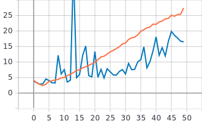
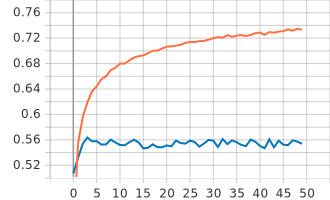
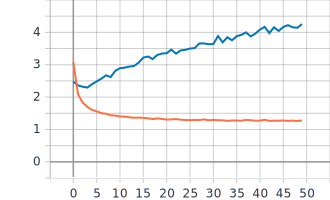
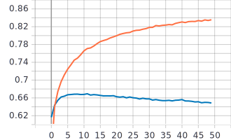
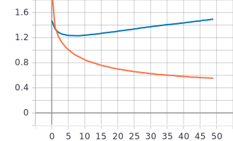

# Лабораторная работа №2.
**Цель лабораторной работы:**
Обучить нейронную сеть с использованием техники
обучения Transfer Learning [1].

**Задачи:**
1. С использованием примера [2] обучить нейронную сеть EfficientNet-B0 [3,4,5]
(случайное начальное приближение) для решения задачи классификации
изображений Food-101 [6].
2. С использованием [2] и техники обучения Transfer Learning [7] обучить нейронную
сеть EfficientNet-B0 (предобученную на базе изображений imagenet) для решения
задачи классификации изображений Food-101.

**Замечание**: В данной лабораторной работе бьл изменен BATCH_SIZE с 256 на 64.

## 1. С использованием примера [2] обучить нейронную сеть EfficientNet-B0 [3,4,5] (случайное начальное приближение) для решения задачи классификации изображений Food-101 [6].
* **Архитектура нейронной сети**:
  * Входные данные (изображение размером 224x224 пикселя): 
  
  ```inputs = tf.keras.Input(shape=(RESIZE_TO, RESIZE_TO, 3)) // 224x224x3```  
  
  * Сеть EfficientNet-B0 с заданными параматрами: 
  
  ```outputs = EfficientNetB0(include_top=True, weights=None, classes=NUM_CLASSES)(inputs)```  
  include_top=True - используем классификатор сети EfficientNet-B0.  
  weights=None - означает, что используем случайное начальное приближение.  
  classes=NUM_CLASSES - задает количество классов. В нашем случае 101.
  
* **Графики обучения EfficientNetB0 со случайным начальным приближением**:  
   Оранжевая линия: обучение.  
   Синияя линия: валидация.
   * График точности epoch_categorical_accuracy:
   
   
   * График функции потерь epoch_loss:
   
 * **Анализ полученных результатов**: На графиках видно, что значения функции потерь при обучении увеличиваются, начиная примерно с 4 эпохи. Это может говорить о том, что данная нейронная сеть перестала обучаться. На графиках метрики точности видно, что примерно в этом же месте (3-4 эпоха) достигается максимальное значение точности (примерно 35% для обучения, и 30% для валидации).
## 2. С использованием [2] и техники обучения Transfer Learning [7] обучить нейронную сеть EfficientNet-B0 (предобученную на базе изображений imagenet) для решения задачи классификации изображений Food-101.
В данном пункте были проведены обучения 2 нейронных сетей. В одном случае операция Pooling на последнем сверточном слое была с параметром max, а в другом - avg. Также стоит отметить, что был изменен тип данных c int64 на uint8 для работы c imagenet:  
```example['image'] = tf.image.convert_image_dtype(example['image'], dtype=tf.uint8)```
* **Архитектура нейронной сети**:    
  
  * Предобученная сеть EfficientNet-B0 на базе изображений imagenet с заданными параматрами: 

  ```x = EfficientNetB0(include_top=False, input_tensor=inputs, pooling='max', weights='imagenet')```  
  include_top=False - отключаем классификатор сети EfficientNet-B0.  
  input_tensor=inputs - входные данные.  
  pooling='max' - метод выборки максимального значания на последнем сверточном слое. (Ниже будут представлены графики и для случая среднего значения avg)  
  weights='imagenet' - используются готовые веса из предобученной сети на базе изображений imagenet.  
  
  * Отключение обучения сети, так как она уже предобучена:  
    
  ```x.trainable = False```  
  
  * Переход из многомерного тензора в одномерный:  
    
  ```x = tf.keras.layers.Flatten()(x.output)```
  
   * Полносвязный слой, в задачу которого входит классификация. Его мы и будем обучать. Параметрами заданы количество классов и активационная функция.
  
  ```outputs = tf.keras.layers.Dense(NUM_CLASSES, activation=tf.keras.activations.softmax)(x)```
  
  
* **Графики обучения предобученной нейронной сети EfficientNet-B0 на базе изображений imagenet (pooling='max')**:  
   Оранжевая линия: обучение.  
   Синияя линия: валидация.
   * График точности epoch_categorical_accuracy:
  
  
   * График функции потерь epoch_loss:
   
   
* **Графики обучения предобученной нейронной сети EfficientNet-B0 на базе изображений imagenet (pooling='avg')**:  
   Оранжевая линия: обучение.  
   Синияя линия: валидация.
   * График точности epoch_categorical_accuracy:
  
  
   * График функции потерь epoch_loss:
   
   
* **Анализ полученных результатов**: Из графиков видно, что 2 предобученные нейронные сети обучаются (точнее их классификаторы). Имеет место переобучение в обоих случаях. В случае с MaxPooling значения метрики точности меньше, чем в случае с AvgPooling(разница примерно 10%). Причнами этого могут быть как сами способы пулинга, так и разные начальные приближения классификаторов. В целом, метод Transfer Learning показывает более хорошие результаты, чем наш первый случай со случайным начальным приближением. Об этом говорят графики метрики точности и функции потерь. 
## Ссылки.
1. https://towardsdatascience.com/a-comprehensive-hands-on-guide-to-transfer-learning-wi
2. https://github.com/AlexanderSoroka/CNN-food-101
3. https://arxiv.org/pdf/1905.11946.pdf
4. https://www.tensorflow.org/api_docs/python/tf/keras/applications/EfficientNetB0
5. https://keras.io/examples/vision/image_classification_efficientnet_fine_tuning/
6. https://www.kaggle.com/kmader/food41
7. https://www.tensorflow.org/tutorials/images/transfer_learning?hl=en
