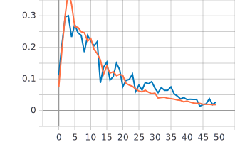

# Лабораторная работа №2.
**Цель лабораторной работы:**
Обучить нейронную сеть с использованием техники
обучения Transfer Learning [1].

**Задачи:**
1. С использованием примера [2] обучить нейронную сеть EfficientNet-B0 [3,4,5]
(случайное начальное приближение) для решения задачи классификации
изображений Food-101 [6].
2. С использованием [2] и техники обучения Transfer Learning [7] обучить нейронную
сеть EfficientNet-B0 (предобученную на базе изображений imagenet) для решения
задачи классификации изображений Food-101.

## 1. С использованием примера [2] обучить нейронную сеть EfficientNet-B0 [3,4,5] (случайное начальное приближение) для решения задачи классификации изображений Food-101 [6].
* **Архитектура нейронной сети**:
  * Входные данные (изображение размером 224x224 пикселя): 
  
  ```inputs = tf.keras.Input(shape=(RESIZE_TO, RESIZE_TO, 3)) // 224x224x3```  
  
  * Сеть EfficientNet-B0 с заданными параматрами: 
  
  ```outputs = EfficientNetB0(include_top=True, weights=None, classes=NUM_CLASSES)(inputs)```  
  include_top=True - используем классификатор сети EfficientNet-B0.  
  weights=None - означает, что используем случайное начальное приближение.  
  classes=NUM_CLASSES - задает количество классов. В нашем случае 101.
  
* **Графики обучения EfficientNetB0 со случайным начальным приближением**:  
   Оранжевая линия: обучение.  
   Синияя линия: валидация.
   * График точности epoch_categorical_accuracy:
   
   
   * График функции потерь epoch_loss:
   
 * **Анализ полученных результатов**: На графиках видно, что значения функции потерь при обучении увеличиваются, начиная примерно с 4 эпохи. Это может говорить о том, что данная нейронная сеть перестала обучаться. На грфиках метрики точности видно, что примерно в этом же месте (3-4 эпоха) достигается максимальное значение точности (примерно 35%). 
## 2. С использованием [2] и техники обучения Transfer Learning [7] обучить нейронную сеть EfficientNet-B0 (предобученную на базе изображений imagenet) для решения задачи классификации изображений Food-101.
В данном пункте были проведены обучения 2 нейронных сетей. В одном случае операция Pooling была с параметром max, а в другом - avg.
* **Архитектура нейронной сети**:    
  
  * Предобученная сеть EfficientNet-B0 на базе изображений imagenet с заданными параматрами: 

  ```x = EfficientNetB0(include_top=False, input_tensor=inputs, pooling='max', weights='imagenet')```  
  include_top=False - отключаем классификатор сети EfficientNet-B0.  
  input_tensor=inputs - входные данные.  
  pooling='max' - метод выборки максимального значания на последнем сверточном слое. (Ниже будут представлены графики и для случая среднего значения avg)
  weights='imagenet' - используются готовые веса из предобученной сети на базе изображений imagenet. 
* **Графики обучения предобучееной нейронной сети EfficientNet-B0 на базе изображений imagenet (pooling='max')**:  
   Оранжевая линия: обучение.  
   Синияя линия: валидация.
   * График точности epoch_categorical_accuracy:
  
  
   * График функции потерь epoch_loss:
   
   
* **Анализ полученных результатов**: Как и в предыдущем случае, наблюдается те же проблемы. Причины остаются теми же. Также наблюдается малое улучшение значений метрики точности в измененной нейронной сети. Одной из причин этого может быть измененная архитектура нейронной сети.   
## Ссылки.
1. https://github.com/AlexanderSoroka/CNN-food-101
